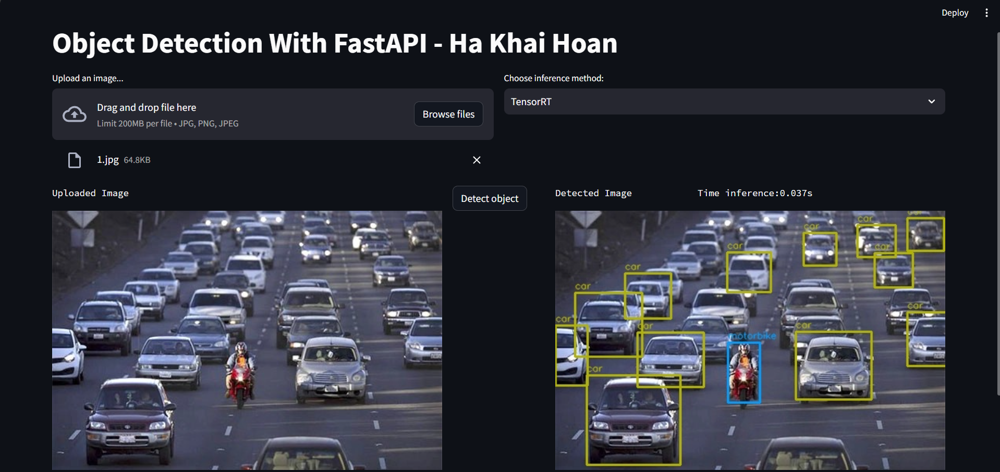

# **Welcome to my Website 💞**
## **OBJECT DETECTION**

## **Overview**
    This is a website, you can upload any photo in your library, the system will detect and mark the location of the object and indicate the name of the object and the system recognizes it.

    Objects that the system can detect:
        +   0: "bicycle"
        +   1: "bus"
        +   2: "car"
        +   3: "motorbike"
        +   4: "person"

## **Developer**
    Ha Khai Hoan
    Email: khaihoan.ai@gmail.com
    GitHub: https://github.com/Hoanha2101

## **User Interface**

    + There are 2 inference methods: ONNX or TensorRT

## **How to run app, api**
<ul>Run_api
	<li>uvicorn api:api --port 8000</li>
    <li>Run python api.py in CMD</li>
</ul>

<ul>Run_app
	<li>streamlit run app.py --server.fileWatcherType=none</li>
</ul>
